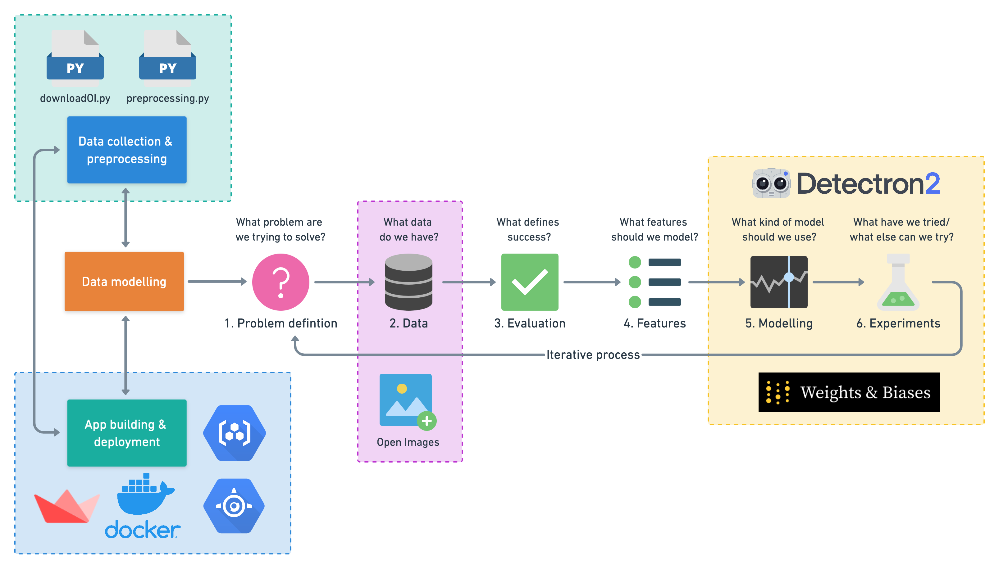
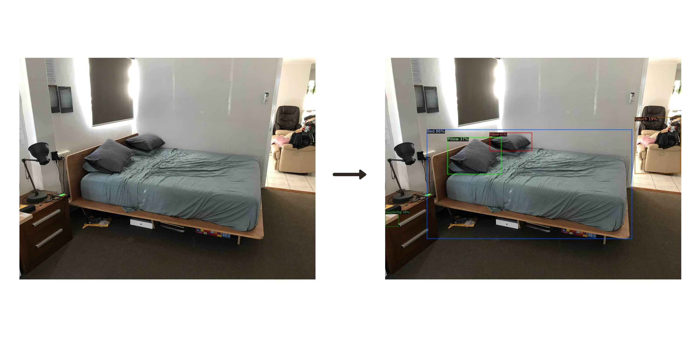
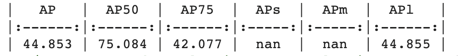

# Airbnb amenity detection using detectron2
#### Final project for Duke AIPI 540: Deep learning applications
<p align="center"></p>

## Motivation
Airbnb gets a lot of photos uploaded to their website everyday. These photos contain alot of items and amenities. Listing down each of the amenities in the house can be laborious. Computer vision comes to the resue. Airbnb used computer vision to automatically label the amenities in each uploaded image.
This project aims to 
 1) Replicate Airbnb's amenity detection algorithm
 2) Beat or atleast equal Airbnb's MVP metric: 50% mAP(mean average precision)
 3) Have a downloadable trained model and a working web application

## Architecture


## Project Structure

```
├── images                                         <- contains all the images
├── models                                         <- contains the trained models
    ├── retinanet_model_final_config.yaml          <- contains the yaml file
    ├── retinanet_model_final.pth                  <- trained pytorch model
├── notebooks                                      <- contains exploratory colab notebooks
├── predictions                                    <- predicted images
├── scripts                                        <- directory of utility scripts
    ├── downloadOI.py                              <- script to download data
    ├── preprocess.py                              <- script to preprocess data
    ├── model.py                                   <- script to train model and predict
├── .gcloudignore                                  <- gcloud ignore file
├── app.py                                         <- streamlit web app
├── README.md                                      <- description of project and how to set up and run it
├── requirements.txt                               <- requirements file to document dependencies
├── .gitignore              <- git ignore file
```
## How to use this repo
### 1) Run the app locally

Execute the following command to run the demo app locally:
```
streamlit run app.py --server.port=8080 --server.address=0.0.0.0
```
which starts the Streamlit app and serves it so that it is avaiable to access from the browser.

### 2) Deploy the app on Google App Engine
- Run streamlit app locally `streamlit run app.py`
- Build docker image `docker build -t airbnbv1`
- Run the docker container `docker run -p 8080:8080 airbnbv1`
- Open the app on gcloud app browse

 ## Data Sources
 All images and labels are sourced from [Open Images images & labels](https://storage.googleapis.com/openimages/web/index.html) 

 ```
   #From Open Images validation set download only images from the Kitchen & dining room table class
   !python3 downloadOI.py --dataset "validation" --classes "Kitchen & dining room table"
 ```
 ## Modeling approach
 Our data is trained on Detectron2. Detectron is a object detection software developed by Facebook AI which aims to provide high quality and industry standard object detection research with incredibly accurate results.

 The detectron model was trained using `DefaultTrainer` method levaraging transfer learning to predict around 30 target classes like Bathtub, Bed, Ceiling fan etc

 The trained model is saved as `retinanet_model_final.pth` and `retinanet_model_final_config.yaml` which store the model weights and config respectively. The saved model and config are further used to build a web app using streamlit and deployed using gcloud

 ## Model prediction and evaluation
 
 
 
  So, the model achieved a mean average precision(mAP) of 46-48%

## Acknowledgement
1) [Airbnb amenity detection using computer vision](https://medium.com/airbnb-engineering/amenity-detection-and-beyond-new-frontiers-of-computer-vision-at-airbnb-144a4441b72e)
2) [Open Image dataset](https://storage.googleapis.com/openimages/web/download.html)
2) [Daniel Bourke](https://www.mrdbourke.com/airbnb-amenity-detection/)
